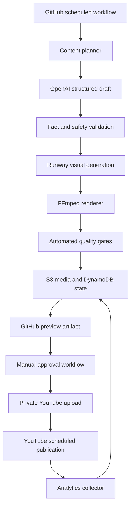

# YouTube Shorts Automation — Codex Implementation Plan

## 1. Mission

Build a production-minded automation system that creates, reviews, schedules, publishes, and measures two YouTube Shorts per day across three content arms:

1. Food comparisons and choices
2. Cooking transformations and challenges
3. Dog entertainment and fictional mini-stories

The system must run through GitHub Actions, require manual approval for every video, use hybrid AI-generated images and short AI-video clips, store durable state in AWS, and enforce a hard monthly generation budget of $45.

This is an implementation specification for Codex. Implement it phase by phase, verify each phase, and do not skip safety gates to reach automation faster.

## 2. Locked Product Decisions

| Area | Decision |
|---|---|
| Orchestration | GitHub Actions |
| Publishing rate | Two Shorts per day |
| Time zone | `America/Los_Angeles` |
| Initial publishing times | 7:00 AM and 5:00 PM, configurable |
| Content arms | Food, cooking, dogs |
| Initial experiment | 30 videos, 10 per arm |
| Approval | Manual approval required for every video |
| Visual production | Hybrid AI images, short AI-video clips, and FFmpeg motion graphics |
| Text model | OpenAI `gpt-5.6-luna` |
| Image model | Runway `gen4_image_turbo` |
| Video model | Runway `gen4_turbo` |
| Factual food data | USDA FoodData Central API |
| Rendering | FFmpeg on GitHub-hosted Ubuntu runners |
| Durable media | Amazon S3 |
| Durable state | Amazon DynamoDB |
| AWS authentication | GitHub Actions OIDC with short-lived credentials |
| Preview delivery | GitHub Actions artifact, retained for 14 days |
| Initial user interface | GitHub Actions and workflow summaries; no web dashboard |
| Monthly generation cap | $45 hard stop |
| Sora | Do not use; its API is being retired |

## 3. Success Criteria

The MVP is successful when it can:

- Generate a structured draft for each content arm.
- Ground food and cooking facts in approved sources.
- Generate still images and, when budget allows, one short video clip.
- Assemble a valid vertical MP4 with captions using FFmpeg.
- Save media to S3 and state to DynamoDB.
- Expose a private preview through a GitHub Actions artifact.
- Require a manually supplied draft ID before accessing YouTube publishing secrets.
- Upload an approved video privately using a resumable upload.
- schedule it using YouTube `status.publishAt`.
- Prevent duplicate uploads and duplicate publication slots.
- Retrieve YouTube metrics at 24 hours, 72 hours, and 7 days.
- Enforce daily, per-video, and monthly spending limits.
- Recover safely from repeated or delayed GitHub workflow runs.
- Run end-to-end in mock mode without paid API calls or a YouTube channel.

## 4. Non-Goals for the First MVP

Do not build these until the core pipeline is verified:

- A custom React dashboard
- Fully autonomous public publishing
- Multiple YouTube channels
- Automatic comment replies
- Automatic music selection from copyrighted catalogs
- Long-form YouTube videos
- TikTok or Instagram publishing
- Model fine-tuning
- Complex multi-armed-bandit optimization before 30 videos exist
- AI-generated health, medical, or weight-loss advice

## 5. System Architecture



GitHub Actions is not the source of truth. Every workflow must be stateless and restartable. S3 and DynamoDB are authoritative.

YouTube, rather than GitHub Actions, must handle the exact public release time. GitHub schedules can be delayed, so approved Shorts must be uploaded and scheduled at least 12 hours before publication whenever possible.

## 6. Repository Structure

Create a Python 3.12 project with this target structure:

```text
youtube-shorts-automation/
├── .github/
│   └── workflows/
│       ├── ci.yml
│       ├── plan-content.yml
│       ├── produce-drafts.yml
│       ├── approve-and-schedule.yml
│       ├── reject-or-regenerate.yml
│       ├── collect-analytics.yml
│       └── reconcile-state.yml
├── config/
│   ├── arms.yaml
│   ├── schedule.yaml
│   ├── budget.yaml
│   └── styles.yaml
├── infra/
│   ├── cloudformation.yaml
│   └── README.md
├── scripts/
│   ├── bootstrap_youtube_oauth.py
│   ├── create_test_fixture.py
│   └── verify_environment.py
├── src/
│   └── shorts_automation/
│       ├── __init__.py
│       ├── cli.py
│       ├── config.py
│       ├── domain/
│       │   ├── models.py
│       │   ├── states.py
│       │   └── errors.py
│       ├── content/
│       │   ├── planner.py
│       │   ├── schemas.py
│       │   ├── prompts.py
│       │   ├── novelty.py
│       │   ├── fact_checker.py
│       │   └── safety.py
│       ├── providers/
│       │   ├── interfaces.py
│       │   ├── openai_text.py
│       │   ├── runway_visuals.py
│       │   ├── usda_fooddata.py
│       │   ├── youtube.py
│       │   └── mocks.py
│       ├── production/
│       │   ├── storyboard.py
│       │   ├── captions.py
│       │   ├── renderer.py
│       │   ├── validator.py
│       │   └── costs.py
│       ├── persistence/
│       │   ├── repository.py
│       │   ├── dynamodb.py
│       │   └── s3.py
│       ├── workflows/
│       │   ├── plan_content.py
│       │   ├── produce_draft.py
│       │   ├── approve_and_schedule.py
│       │   ├── collect_analytics.py
│       │   └── reconcile.py
│       └── observability/
│           ├── logging.py
│           └── summaries.py
├── tests/
│   ├── unit/
│   ├── integration/
│   ├── contract/
│   └── fixtures/
├── .env.example
├── .gitignore
├── pyproject.toml
├── README.md
└── Makefile
```

Keep vendor SDKs behind provider interfaces. Business logic must not import vendor SDKs directly.

## 7. Domain Model and State Machine

Use a UUIDv7 or UUID4 `video_id` as the permanent internal identifier.

Required states:

```text
PLANNED
SCRIPTED
FACT_CHECKED
GENERATING
GENERATED
RENDERING
VALIDATING
NEEDS_REVIEW
APPROVED
UPLOADING
SCHEDULED
PUBLISHED
MEASURING
COMPLETE

GENERATION_FAILED
VALIDATION_FAILED
UPLOAD_FAILED
PROCESSING_FAILED
REJECTED
CANCELLED
```

State transitions must be validated centrally. No workflow may update state with arbitrary strings.

Every transition must append an immutable audit event containing:

- `video_id`
- old state
- new state
- timestamp in UTC
- workflow run ID
- actor or trigger
- attempt number
- optional reason and error code

## 8. Structured Content Schema

The text model must return JSON validated with Pydantic. Do not parse free-form prose.

Minimum draft schema:

```json
{
  "video_id": "uuid",
  "arm": "FOOD",
  "format": "PICK_ONE",
  "topic": "high-protein breakfasts",
  "hook": "Which breakfast has more protein?",
  "target_duration_seconds": 24,
  "scenes": [
    {
      "scene_number": 1,
      "duration_seconds": 2.0,
      "narration": null,
      "caption": "Which has more protein?",
      "visual_prompt": "...",
      "visual_type": "IMAGE"
    }
  ],
  "facts": [
    {
      "claim": "...",
      "source_type": "USDA_FDC",
      "source_id": "...",
      "source_url": "..."
    }
  ],
  "title": "...",
  "description": "...",
  "tags": ["..."],
  "comment_prompt": "A or B?",
  "contains_synthetic_media": true,
  "made_for_kids": false
}
```

Validate total scene duration, allowed enums, caption lengths, title length, factual citations, and visual budgets before any paid generation call.

## 9. Content Arms

### 9.1 Food

Allowed formats:

- `PICK_ONE`
- `GUESS_THE_FOOD`
- `PRICE_COMPARISON`
- `PORTION_COMPARISON`
- `NUTRIENT_REVEAL`

Default structure:

1. Two-second question or visual hook
2. Options or comparison
3. Short countdown
4. Reveal
5. One-sentence explanation
6. Direct comment question

Facts about calories, protein, ingredients, and portions must come from USDA FoodData Central or another explicitly approved source. The model may not invent nutrient values.

### 9.2 Cooking

Allowed formats:

- `THREE_INGREDIENT_CHALLENGE`
- `FOOD_TRANSFORMATION`
- `ONE_INGREDIENT_THREE_WAYS`
- `BUDGET_MEAL`
- `COOKING_EXPERIMENT`

Default structure:

1. Show finished result first
2. Introduce the constraint
3. Show preparation steps
4. Reveal final result
5. End with a choice or rating question

Do not claim a generated recipe has been physically tested. Food safety temperatures and allergy claims require approved factual sources.

### 9.3 Dogs

Allowed formats:

- `FUNNY_POV`
- `DOG_HAS_ONE_JOB`
- `DOG_CHOOSES`
- `WHOLESOME_MINI_STORY`
- `FICTIONAL_ADVENTURE`

Default structure:

1. Unusual situation in the first two seconds
2. Clear setup
3. Escalation
4. Funny or wholesome payoff
5. Seamless loop or short question

Prohibited dog formats:

- Fake rescues presented as real
- Fake abuse, injury, death, or abandonment scenarios
- Deceptive real-world claims
- Impersonation of a real person or pet
- Distress imagery designed only to manipulate engagement

Fictional generated scenes must be described and disclosed as synthetic when they appear realistic.

## 10. Initial Experiment Allocation

For the first 30 successfully published videos:

- 10 food
- 10 cooking
- 10 dogs

Rotate arms through both publishing slots:

| Day in cycle | 7:00 AM | 5:00 PM |
|---|---|---|
| 1 | Food | Cooking |
| 2 | Dogs | Food |
| 3 | Cooking | Dogs |

Repeat the three-day cycle. Do not change allocation based on early results until at least 30 published videos have seven-day metrics.

After the initial experiment, implement a configurable allocation policy with this default:

- 60% strongest arm
- 25% second arm
- 15% exploration

Adaptive allocation must remain disabled by default in the MVP.

## 11. Visual Generation Strategy

Each Short should normally contain:

- Four to six generated still images
- Zero or one four-second generated video clip
- FFmpeg-generated zoom, pan, crop, transitions, text, progress indicators, and countdowns
- Captions burned into the video
- Optional owned or properly licensed background audio

Use the video clip for the hook or payoff, not as the entire Short.

Provider interfaces:

```python
class TextProvider(Protocol):
    def generate_draft(self, request: DraftRequest) -> StructuredDraft: ...

class VisualProvider(Protocol):
    def generate_image(self, request: ImageRequest) -> GeneratedAsset: ...
    def generate_video(self, request: VideoRequest) -> GeneratedAsset: ...

class FactProvider(Protocol):
    def search(self, query: str) -> list[FactRecord]: ...

class PublishingProvider(Protocol):
    def upload_private(self, request: UploadRequest) -> UploadResult: ...
    def schedule(self, video_id: str, publish_at: datetime) -> None: ...
```

Include mock implementations with deterministic fixtures.

## 12. Rendering Requirements

FFmpeg output must satisfy:

- MP4 container
- H.264 video
- AAC audio when audio exists
- 1080x1920 preferred; 720x1280 accepted for the MVP
- 9:16 display aspect ratio
- 30 fps
- 15–35 seconds target
- Under 59 seconds hard maximum
- `yuv420p` pixel format
- Fast-start metadata enabled
- No black or empty first frame
- Captions inside mobile-safe margins
- Audio normalized without clipping

Use `ffprobe` after rendering. Reject output when duration, streams, codecs, dimensions, frame count, or file size are invalid.

## 13. Quality Gates

A video may enter `NEEDS_REVIEW` only if all checks pass:

- Schema is valid.
- Idea is not substantially similar to recent published ideas.
- Required facts have approved source IDs.
- Script contains no prohibited claims.
- All expected assets exist and decode.
- Captions are present and fit within limits.
- Render opens successfully with `ffprobe`.
- Duration and aspect ratio are valid.
- Audio is present only when expected.
- Estimated and actual generation cost are within limits.
- Synthetic-media field is set correctly.
- Made-for-kids field is explicitly set.
- Title and description are non-empty and valid.

Failed gates must record machine-readable error codes.

## 14. Persistence Design

### 14.1 DynamoDB

Use one table with partition key `PK` and sort key `SK`. Keep access behind a repository interface.

Suggested records:

```text
PK=VIDEO#<video_id>    SK=META
PK=VIDEO#<video_id>    SK=EVENT#<timestamp>#<event_id>
PK=VIDEO#<video_id>    SK=METRIC#24H
PK=VIDEO#<video_id>    SK=METRIC#72H
PK=VIDEO#<video_id>    SK=METRIC#7D
PK=SLOT#<yyyy-mm-dd>    SK=<publish_timestamp>#<video_id>
PK=CONFIG              SK=GLOBAL
PK=BUDGET#<yyyy-mm>     SK=TOTAL
PK=IDEA_HASH#<hash>     SK=<created_timestamp>
```

Add conditional writes for:

- Claiming a production job
- Reserving a publication slot
- Approving a draft once
- Saving the first successful YouTube upload ID
- Reserving generation budget

Use TTL only for temporary locks and disposable deduplication records—not for audit history.

### 14.2 S3

Suggested key layout:

```text
videos/<video_id>/draft.json
videos/<video_id>/script.json
videos/<video_id>/assets/images/<asset_id>.png
videos/<video_id>/assets/clips/<asset_id>.mp4
videos/<video_id>/captions/captions.ass
videos/<video_id>/renders/final.mp4
videos/<video_id>/reports/validation.json
videos/<video_id>/reports/cost.json
```

Bucket requirements:

- Block all public access.
- Enable encryption at rest.
- Enable versioning if affordable.
- Configure lifecycle deletion:
  - Failed and rejected assets after 14 days
  - Raw generated assets after 30 days
  - Approved source assets after 90 days
  - Published final videos after one year
- Never place secrets or OAuth tokens in S3.

## 15. Budget Enforcement

Budget configuration:

```yaml
monthly_hard_limit_usd: 45.00
daily_generation_limit_usd: 1.75
per_video_target_usd: 0.50
per_video_hard_limit_usd: 0.70
max_image_attempts_per_scene: 2
max_video_attempts_per_video: 2
default_ai_video_seconds: 4
```

Before every paid call:

1. Estimate its cost.
2. Atomically reserve that amount in the monthly budget record.
3. Refuse the call if it would exceed any hard limit.
4. Record actual cost after completion.
5. Release unused reservation when supported.

If cost cannot be determined, fail closed and require a configured fallback estimate.

When the monthly cap is reached:

- Stop new paid generation.
- Continue validation, review, analytics, and already approved scheduling.
- Generate a clear workflow summary and failure code.
- Do not silently switch to a more expensive model.

## 16. GitHub Actions Workflows

### 16.1 `ci.yml`

Triggers:

- Pull requests
- Pushes to the default branch

Runs:

- Dependency installation with a lockfile
- Formatting check
- Static type checking
- Unit tests
- Integration tests using mocks
- Security checks for accidental secrets
- FFmpeg smoke render

No paid APIs and no production secrets.

### 16.2 `plan-content.yml`

Triggers:

- Daily at a non-peak minute such as 2:17 AM Pacific
- Manual `workflow_dispatch`

Responsibilities:

- Read current content buffer.
- Create ideas until at least seven planned ideas exist.
- Apply the fixed 30-video arm rotation.
- Deduplicate against recent ideas.
- Write `PLANNED` records.

### 16.3 `produce-drafts.yml`

Triggers:

- Every 30 minutes at minutes 17 and 47
- Manual `workflow_dispatch` with optional `video_id`

Responsibilities:

- Acquire one production job using a conditional lock.
- Generate and validate the structured script.
- Fetch factual evidence.
- Generate images and optional video clip.
- Render and validate the MP4.
- Save output to S3.
- Upload the MP4 as a GitHub artifact with `retention-days: 14`.
- Write a complete workflow summary.
- Transition to `NEEDS_REVIEW`.

Limit parallel generation with a concurrency group. A repeated run must not produce a second copy of a completed draft.

### 16.4 `approve-and-schedule.yml`

Trigger:

- Manual `workflow_dispatch` only

Required inputs:

- `video_id`
- `publish_at`
- `confirm_public_schedule`, a required boolean

Responsibilities:

- Load the immutable draft record.
- Require state `NEEDS_REVIEW`.
- Re-run non-paid validation.
- Validate future publication time.
- Reserve the publication slot conditionally.
- Transition to `APPROVED`.
- Access YouTube production secrets only in this workflow.
- Upload privately using resumable upload.
- Persist the YouTube video ID immediately.
- Poll processing status.
- Set `status.publishAt` while privacy remains private.
- Set `status.containsSyntheticMedia` appropriately.
- Set `status.selfDeclaredMadeForKids` explicitly.
- Verify scheduled state through a read-back call.
- Transition to `SCHEDULED`.

If a workflow crashes after upload, reconciliation must discover and preserve the existing upload rather than upload another copy.

### 16.5 `reject-or-regenerate.yml`

Manual inputs:

- `video_id`
- action: `REJECT` or `REGENERATE`
- reason
- optional scene numbers to regenerate

Regeneration must create a new draft version while retaining the original audit trail and cost.

### 16.6 `collect-analytics.yml`

Triggers:

- Every six hours at a non-peak minute
- Manual dispatch

Responsibilities:

- Find published videos missing 24-hour, 72-hour, or seven-day snapshots.
- Query YouTube Analytics with authorized channel credentials.
- Store immutable snapshots.
- Calculate normalized metrics.
- Transition mature videos to `COMPLETE`.

### 16.7 `reconcile-state.yml`

Triggers:

- Every six hours
- Manual dispatch

Responsibilities:

- Clear expired locks.
- Check stuck generation jobs.
- Reconcile known YouTube IDs with current upload and processing status.
- Verify future scheduled videos.
- Detect duplicate slots.
- Emit alerts and summaries.
- Never delete or republish a video automatically.

## 17. Manual Approval Experience

Each draft workflow summary must show:

- Draft ID
- Content arm and format
- Intended publication slot
- Title and description
- Complete script
- Factual claims and source links
- Duration
- Estimated and actual cost
- Synthetic-media status
- Validation warnings
- Instructions to download the preview artifact
- Exact steps for running the approval or rejection workflow

Approval is a separate workflow invocation, not a job waiting indefinitely. This keeps the design compatible with private repositories and makes approval auditable.

## 18. YouTube Authentication and Publishing

Create `scripts/bootstrap_youtube_oauth.py` for a one-time local OAuth flow. It must:

- Request the minimum scopes needed for upload and analytics.
- Print instructions for adding the refresh token as a GitHub secret.
- Never write tokens into tracked files.
- Confirm the authenticated channel ID.

Required GitHub secrets:

```text
OPENAI_API_KEY
RUNWAYML_API_SECRET
YOUTUBE_CLIENT_ID
YOUTUBE_CLIENT_SECRET
YOUTUBE_REFRESH_TOKEN
YOUTUBE_CHANNEL_ID
USDA_API_KEY
AWS_ROLE_ARN
```

Required GitHub variables:

```text
AWS_REGION
S3_BUCKET
DYNAMODB_TABLE
PUBLISH_TIMEZONE
PUBLISHING_ENABLED
MONTHLY_BUDGET_USD
```

Default `PUBLISHING_ENABLED=false`. Production publishing must fail closed when the variable is missing.

YouTube rules:

- Upload as private.
- Use resumable uploads with bounded exponential backoff.
- Set `publishAt` only on a private, never-before-published video.
- Persist the returned YouTube ID before subsequent API calls.
- Verify upload processing before declaring success.
- Treat policy, copyright, metadata, and authentication failures as manual-review errors.
- Retry only transient network, rate-limit, and server failures.

## 19. Security Requirements

- Use GitHub OIDC to assume an AWS IAM role.
- Restrict the role trust policy to the specific repository and branch or environment.
- Grant only required S3 object and DynamoDB item permissions.
- Store API secrets only in GitHub Secrets.
- Separate production publishing secrets from ordinary CI jobs.
- Set explicit minimal `permissions:` in every workflow.
- Pin third-party GitHub Actions to reviewed commit SHAs.
- Never log tokens, authorization headers, prompts containing secrets, or signed URLs.
- Redact vendor responses before logging when they may contain request data.
- Block public S3 access.
- Add secret-scanning tests and a documented rotation procedure.
- Do not provision infrastructure or make public uploads without explicit user authorization.

## 20. Observability and Failure Handling

Use structured JSON logs containing:

- timestamp
- video ID
- workflow name and run ID
- arm
- state
- provider
- attempt
- latency
- estimated and actual cost
- error code

Workflow summaries should remain human-readable.

Required error categories:

- `CONFIGURATION_ERROR`
- `BUDGET_EXCEEDED`
- `FACT_CHECK_FAILED`
- `SAFETY_REJECTED`
- `PROVIDER_TRANSIENT_ERROR`
- `PROVIDER_PERMANENT_ERROR`
- `RENDER_FAILED`
- `VALIDATION_FAILED`
- `OAUTH_REVOKED`
- `UPLOAD_REJECTED`
- `YOUTUBE_PROCESSING_FAILED`
- `DUPLICATE_PREVENTED`
- `STATE_CONFLICT`

Never catch and discard exceptions. Persist terminal errors and make the workflow fail visibly.

## 21. Analytics

Capture at 24 hours, 72 hours, and seven days:

- Views
- Engaged views
- Average view duration
- Average view percentage
- Likes
- Comments
- Shares
- Subscribers gained
- Subscribers lost
- Estimated minutes watched

Derived metrics:

- Engaged views divided by views
- Likes per 1,000 engaged views
- Comments per 1,000 engaged views
- Shares per 1,000 engaged views
- Subscribers gained per 1,000 engaged views
- Cost per engaged view

Do not optimize on raw views alone. Preserve metric snapshots so later view-count definition changes do not rewrite historical decisions.

## 22. Infrastructure as Code

Create an AWS CloudFormation template for:

- Private S3 bucket
- S3 lifecycle rules
- DynamoDB table
- GitHub Actions IAM role
- Least-privilege policies
- Optional AWS budget alarm or cost alert

Do not assume a GitHub OIDC provider can safely be created twice. Document how to detect and reuse an existing provider.

The infrastructure README must include:

- Required parameters
- Safe preview or validation commands
- Deployment commands
- Teardown implications
- Exact permissions created
- How to restrict the OIDC subject to the correct repository

Codex may generate infrastructure files and validation commands, but it must not deploy them without explicit authorization.

## 23. Testing Strategy

### Unit tests

Test:

- State transitions
- Pydantic schemas
- Arm rotation
- Publication-slot selection
- Cost estimates and reservations
- Deduplication hashes
- Fact requirements
- Safety rules
- Retry classification
- Metadata validation

### Contract tests

Use recorded, sanitized fixtures to verify adapters for:

- OpenAI structured output
- Runway generation status and asset metadata
- USDA food search and detail responses
- YouTube uploads, processing status, scheduling, and analytics

Contract tests must not make paid calls by default.

### Integration tests

Test with local mocks or AWS-compatible test doubles:

- Full draft generation
- S3 and DynamoDB repository behavior
- Conditional locks
- Duplicate approval attempts
- Duplicate publication slots
- Analytics snapshot idempotency
- Failed render recovery

### End-to-end dry run

Produce one fixture Short for each arm without external paid calls. Validate all three MP4 files with `ffprobe`.

### Critical safety tests

Prove that:

- Dry-run mode cannot upload publicly.
- Missing `PUBLISHING_ENABLED=true` blocks YouTube upload.
- A draft cannot be approved twice.
- A final file cannot be uploaded twice.
- A rejected draft cannot publish.
- A validation failure cannot publish.
- A monthly budget cap blocks new generation.
- A delayed scheduled workflow does not create duplicate work.
- Revoked OAuth credentials pause publication safely.
- Production secrets are unavailable to pull-request workflows.

## 24. Implementation Phases

### Phase 0 — Repository and contracts

Deliver:

- Project skeleton
- Dependency lockfile
- Configuration loader
- Domain models and states
- Provider interfaces
- Mock providers
- CI workflow

Exit criteria:

- CI passes.
- Mock structured drafts validate for all three arms.
- State-machine tests pass.

### Phase 1 — Deterministic video assembly

Deliver:

- Caption generation
- FFmpeg renderer
- `ffprobe` validator
- Three fixture-based Shorts

Exit criteria:

- One valid MP4 per arm.
- All media validation tests pass.
- No paid APIs required.

### Phase 2 — Persistence and infrastructure

Deliver:

- S3 adapter
- DynamoDB repository
- Conditional locks and slot reservations
- CloudFormation template
- OIDC documentation

Exit criteria:

- Local or test-double integration tests pass.
- Duplicate job and slot tests pass.
- Infrastructure template validates without deployment.

### Phase 3 — Content and facts

Deliver:

- OpenAI Luna adapter
- Structured prompts
- Arm templates
- Novelty checks
- USDA adapter
- Fact and safety gates

Exit criteria:

- Drafts remain schema-valid under mocked and optional sandbox calls.
- Unsupported factual claims are rejected.
- No production credentials are required for CI.

### Phase 4 — Visual generation and cost control

Deliver:

- Runway adapter
- Image and video polling
- Cost reservation ledger
- Generation retries
- Asset validation

Exit criteria:

- Mock end-to-end path passes.
- Optional one-video sandbox generation stays below the configured per-video cap.
- Provider failures produce correct terminal or retryable states.

### Phase 5 — Draft automation and review

Deliver:

- Planner workflow
- Production workflow
- S3 final storage
- 14-day GitHub preview artifacts
- Review workflow summaries
- Rejection and regeneration workflow

Exit criteria:

- A manually dispatched workflow creates a reviewable draft.
- Re-running the workflow does not duplicate work.
- No YouTube credentials are needed yet.

### Phase 6 — YouTube private upload and scheduling

Deliver:

- OAuth bootstrap script
- YouTube adapter
- Manual approval workflow
- Resumable private upload
- Processing checks
- Future `publishAt` scheduling
- Synthetic-media and made-for-kids fields

Exit criteria:

- With explicit user authorization, one test video uploads privately.
- The system records and reads back the scheduled state.
- Reconciliation prevents duplicate upload after simulated interruption.

### Phase 7 — Analytics

Deliver:

- Analytics collector
- Snapshot storage
- Derived metric calculations
- Workflow summaries by arm and format

Exit criteria:

- Fixture metrics and, when authorized, channel metrics are stored idempotently.
- 24-hour, 72-hour, and seven-day windows are correctly selected.

### Phase 8 — Controlled production launch

Deliver:

- Two daily configured slots
- Three-video ready buffer
- Fixed 30-video arm rotation
- Reconciliation and alerts
- Operational runbook

Exit criteria:

- At least three approved videos can be scheduled in advance.
- Every public schedule requires a manual approval workflow.
- Monthly cap and kill switches are demonstrated.

### Phase 9 — Later optimization

Only after sufficient production data:

- Enable adaptive allocation behind a feature flag.
- Add comment-to-content suggestions.
- Add optional voiceover.
- Add a dashboard.
- Add separate channels for divergent audiences.

## 25. Codex Execution Instructions

When this plan is given to Codex:

1. Inspect the current repository and any `AGENTS.md` instructions before editing.
2. Report whether this is a new repository or an integration into existing code.
3. Create an explicit working plan matching the phases above.
4. Implement only one phase at a time.
5. Run relevant tests after every phase.
6. Preserve unrelated user changes in a dirty worktree.
7. Use `.env.example` with placeholders; never create real secrets.
8. Do not deploy AWS resources without explicit approval.
9. Do not make paid model calls without explicit approval during setup.
10. Do not upload to YouTube without explicit approval.
11. Do not enable public publishing during initial implementation.
12. Stop and report any requirement that would exceed the $45 budget or weaken a safety gate.
13. At every handoff, list completed files, verification performed, unresolved blockers, and the exact next phase.

## 26. Definition of Done

The project is complete for the initial MVP when:

- All workflows and commands are documented.
- All automated tests pass.
- Three deterministic fixture videos render correctly.
- Mock end-to-end processing works without external services.
- AWS infrastructure is defined and validated.
- GitHub OIDC and secret setup are documented.
- The system can generate a real draft under the cost cap when authorized.
- Every real draft requires manual approval.
- One private YouTube upload and schedule has been verified when authorized.
- Duplicate uploads and slots are prevented.
- Analytics snapshots are collected idempotently.
- The production runbook explains pause, recovery, credential rotation, rejection, regeneration, and cost-limit behavior.

## 27. Official References

- [GitHub Actions scheduled workflows](https://docs.github.com/en/actions/reference/workflows-and-actions/events-that-trigger-workflows#schedule)
- [GitHub Actions OIDC for AWS](https://docs.github.com/actions/deployment/security-hardening-your-deployments/configuring-openid-connect-in-amazon-web-services)
- [YouTube video resource and scheduled publishing](https://developers.google.com/youtube/v3/docs/videos)
- [YouTube resumable video upload](https://developers.google.com/youtube/v3/guides/uploading_a_video)
- [YouTube Analytics API](https://developers.google.com/youtube/analytics)
- [YouTube Analytics metrics](https://developers.google.com/youtube/analytics/metrics)
- [YouTube monetization policies](https://support.google.com/youtube/answer/1311392)
- [OpenAI GPT-5.6 Luna](https://developers.openai.com/api/docs/models/gpt-5.6-luna)
- [Runway API pricing](https://docs.dev.runwayml.com/guides/pricing/)
- [USDA FoodData Central API](https://fdc.nal.usda.gov/api-guide/)
- [Amazon DynamoDB pricing](https://aws.amazon.com/dynamodb/pricing/)

